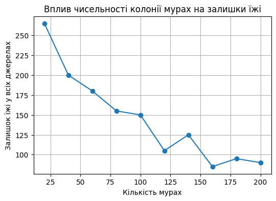
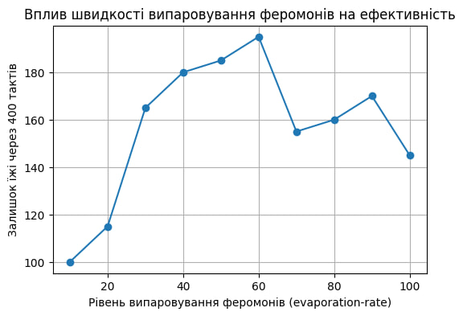

## Комп'ютерні системи імітаційного моделювання
## СПм-24-2, **Кліменко Артем Володимирович**
### Лабораторна робота №**1**. Опис імітаційних моделей та проведення обчислювальних експериментів

### Варіант 10, модель у середовищі NetLogo:
[Ants](https://www.netlogoweb.org/launch#http://www.netlogoweb.org/assets/modelslib/Sample%20Models/Biology/Ants.nlogox)

### Вербальний опис моделі:

Ця модель відтворює механізм самоорганізації мурашиної колонії під час пошуку та збору ресурсів. Кожна мураха діє як автономний агент, що керується простими правилами: блукання у пошуках їжі, маркування успішного шляху феромонами та слідування за хімічним сигналом, залишеним іншими. Завдяки позитивному зворотному зв'язку (чим більше мурах пройшло шляхом, тим сильніший запах) колонія знаходить оптимальні маршрути до джерел харчування, створюючи складну систему логістики без єдиного центру керування.

### Керуючі параметри:

* **population**: Визначає загальну кількість мурах у симуляції (0–200). Впливає на швидкість виявлення нових джерел та інтенсивність підтримки феромонних стежок.
* **diffusion-rate**: Коефіцієнт поширення феромонів. Визначає, наскільки активно хімічна речовина розсіюється на сусідні ділянки, розширюючи "зону видимості" стежки.
* **evaporation-rate**: Швидкість випаровування. Регулює час життя хімічного сліду. Високі значення змушують мурах швидше адаптуватися до нових умов, але роблять стежки менш стабільними.

### Внутрішні параметри:

* **chemical**: Концентрація феромону на конкретному патчі. Візуально відображається відтінками зеленого.
* **food**: Кількість одиниць їжі на ділянці (0, 1 або 2).
* **nest?**: Булева змінна, що ідентифікує центральну зону як гніздо колонії.
* **nest-scent**: Статичне числове поле, значення якого зростає при наближенні до гнізда. Використовується мурахами як навігаційний орієнтир (компас) для повернення додому.
* **food-source-number**: Номер джерела їжі (1, 2 або 3), що дозволяє розрізняти різні локації ресурсів.

### Показники роботи системи:

* **Залишки їжі у джерелах**: Основна метрика, що відображається на графіку в реальному часі. Дозволяє оцінити динаміку вичерпання кожного з трьох джерел окремо.
* **Час повного збору**: Кількість тактів (ticks), необхідна для повного перенесення ресурсів до гнізда.

### Примітки:

Мурахи змінюють свій стан візуально: **червоний** колір означає вільний пошук, а **помаранчевий** — транспортування знайденої їжі. Колонія демонструє послідовну стратегію: спочатку зазвичай виснажується найближче джерело, а вже потім увага агентів перемикається на віддалені зони.

### Недоліки моделі:

1. **Відсутність конкуренції**: У моделі представлена лише одна колонія, що не відображає реальну міжвидову боротьбу за ресурси.
2. **Статичність середовища**: Кількість та розташування джерел їжі фіксовані в коді, що не дозволяє тестувати адаптивність колонії до динамічної появи нових ресурсів через інтерфейс.
3. **Безсмертя агентів**: Кількість мурах залишається незмінною протягом всієї симуляції, що ігнорує біологічні цикли та природні втрати.

## Обчислювальні експерименти

### 1. Вплив чисельності популяції на швидкість збору їжі

Досліджується, як зміна кількості агентів впливає на ефективність роботи всієї системи за фіксований час (400 тактів). На старті загальний обсяг їжі складає приблизно 300 одиниць.

**Початкові умови:**

* `diffusion-rate`: 50
* `evaporation-rate`: 10
* Тривалість: 400 тактів.

Результати експериментів:
1.Вплив чисельності колонії мурах на залишки їжі в джерелах після завершення симуляції.
<table>
<thead>
<tr><th>Кількість мурах</th><th>Скільки залишилось їжі у всіх джерелах</tr>
</thead>
<tbody>
<tr><td>20</td><td>265</td></tr>
<tr><td>40</td><td>200</td></tr>
<tr><td>60</td><td>180</td></tr>
<tr><td>80</td><td>155</td></tr>
<tr><td>100</td><td>150</td></tr>
<tr><td>120</td><td>105</td></tr>
<tr><td>140</td><td>125</td></tr>
<tr><td>160</td><td>85</td></tr>
<tr><td>180</td><td>95</td></tr>
<tr><td>200</td><td>90</td></tr>

</tbody>
</table>

Графік наочно демонструє, що зі збільшенням чисельності мурах кількість їжі в джерелах зменшується. Це очікувано, адже більша кількість мурах забезпечує швидше виявлення і транспортування їжі до гнізда, а також створення стабільних феромонних слідів, які полегшують роботу колонії.

### 2. Вплив швидкості випаровування феромонів на стабільність маршрутів
У цьому експерименті аналізується, як тривалість «життя» хімічного сліду впливає на здатність колонії підтримувати ефективні логістичні шляхи. Чим швидше випаровується феромон, тим частіше мурахи мають його оновлювати для збереження навігації.

**Початкові умови:**

* `population`: 125
* `diffusion-rate`: 50
* Тривалість: 400 тактів.

<table> <thead> <tr><th>Рівень випаровування (evaporation-rate)</th><th>Залишок їжі через 400 тактів</th></tr> </thead> <tbody> <tr><td>10</td><td>100</td></tr> <tr><td>20</td><td>115</td></tr> <tr><td>30</td><td>165</td></tr> <tr><td>40</td><td>180</td></tr> <tr><td>50</td><td>185</td></tr> <tr><td>60</td><td>195</td></tr> <tr><td>70</td><td>155</td></tr> <tr><td>80</td><td>160</td></tr> <tr><td>90</td><td>170</td></tr> <tr><td>100</td><td>145</td></tr> </tbody> </table>

З результатів видно, що при збільшенні швидкості випаровування залишається більше їжі у всіх джерелах. Це може бути пов'язано з тим, що менший час випаровування дозволяє феромонам залишатися довше та краще вказувати шляхи для збору їжі. 

### 3. Вплив дифузії феромонів на ефективність збору їжі
Цей експеримент досліджує, як зміна швидкості розповсюдження феромонів впливає на ефективність збору їжі колонією. Кожна симуляція триває 400 тактів.
Значення дифузії варіюються в діапазоні від 10 до 100 з кроком 10, загалом проведено 10 симуляцій.

**Початкові умови:**
* `population`: 125
* `evaporation-rate`: 10
На початку кожної симуляції загальний обсяг їжі в усіх джерелах становить близько 300 одиниць.

<table>
<thead>
<tr><th>Дифузія</th><th>Скільки залишилось їжі у всіх джерелах</th></tr>
</thead>
<tbody>
<tr><td>10</td><td>130</td></tr>
<tr><td>20</td><td>110</td></tr>
<tr><td>30</td><td>150</td></tr>
<tr><td>40</td><td>165</td></tr>
<tr><td>50</td><td>160</td></tr>
<tr><td>60</td><td>140</td></tr>
<tr><td>70</td><td>125</td></tr>
<tr><td>80</td><td>135</td></tr>
<tr><td>90</td><td>105</td></tr>
<tr><td>100</td><td>150</td></tr>
</tbody>
</table>

Графік показує на нелінійний характер залежності: найкращі результати (найменші залишки їжі) спостерігаються при значеннях дифузії близько 20 та 90. Це свідчить про те, що для даної конфігурації колонії критично важливим є баланс між чіткістю градієнта та площею охоплення хімічного сигналу.
