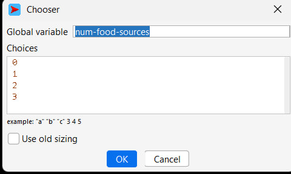
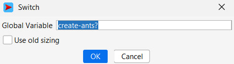
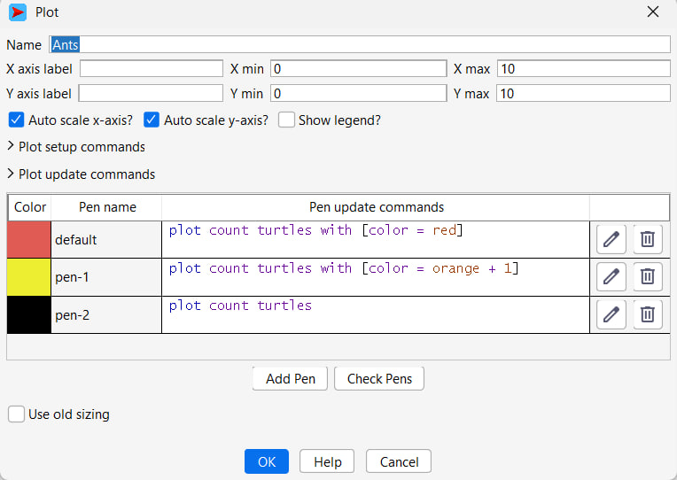
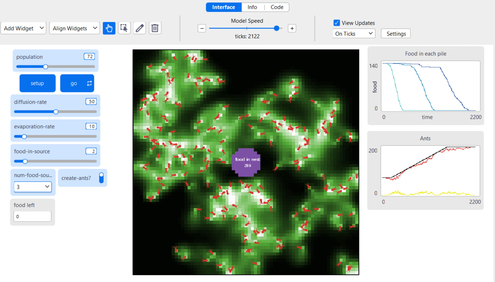
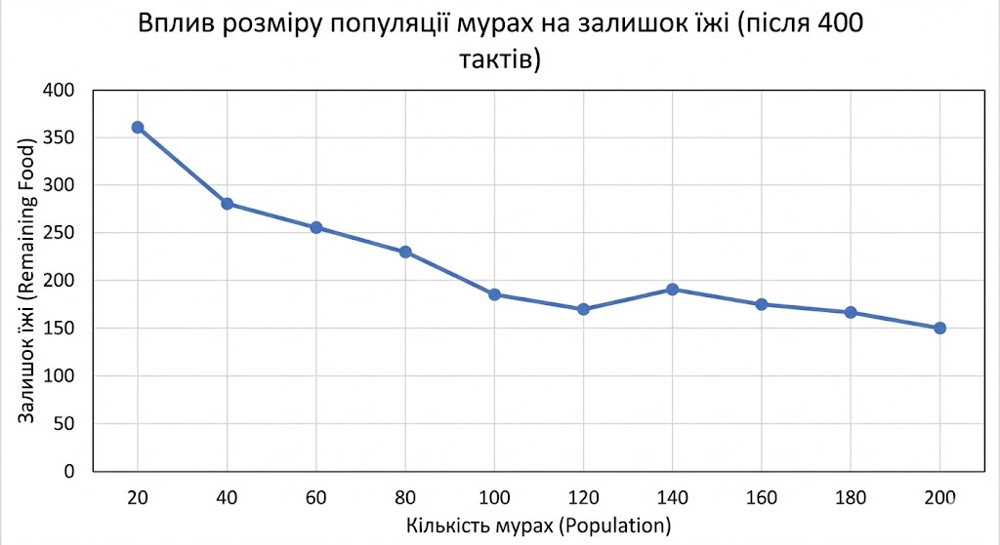

## Комп'ютерні системи імітаційного моделювання
## СПм-24-2, **Клименко Артем Владимирович**
### Лабораторна робота №**2**. Редагування імітаційних моделей у середовищі NetLogo

### Варіант 10, модель у середовищі NetLogo:
[Ants](https://www.netlogoweb.org/launch#http://www.netlogoweb.org/assets/modelslib/Sample%20Models/Biology/Ants.nlogox)
 

Додати можливість вказувати кількість джерел їжі на полі. Ввести показник кількості зібраної їжі у гнізді, що відображається користувачеві. Відключаєма можливість появи нових мурах за умов наявності достатньої кількості їжі у гнізді. Відображати графік зміни кількості мурах.

### Внесені зміни у вихідну логіку моделі, за варіантом:
1. Кількість джерел їжі Додано можливість динамічно змінювати кількість джерел їжі на полі (від 1 до 3) за допомогою нового селектора num-food-sources. Це дозволяє оцінювати ефективність пошукового алгоритму при різній щільності ресурсів.

Зміни у процедурі setup-food: Якщо значення селектора менше за порогове, відповідне джерело не створюється.

Фрагмент коду
<pre>
 to setup-food  ;; patch procedure
  ;; setup food source one on the right
  if (distancexy (0.6 * max-pxcor) 0) < 5 and num-food > 0
  [ set food-source-number 1 ]
  ;; setup food source two on the lower-left
  if (distancexy (-0.6 * max-pxcor) (-0.6 * max-pycor)) < 5 and num-food > 1
  [ set food-source-number 2 ]
  ;; setup food source three on the upper-left
  if (distancexy (-0.8 * max-pxcor) (0.8 * max-pycor)) < 5 and num-food > 2
  [ set food-source-number 3 ]
  ;; set "food" at sources to either 1 or 2, randomly
  if food-source-number > 0
  [ set food one-of [1 2] ]
end
</pre>

Доданий відповідний селектор:

                  
**Додано показник кількості зібраної їжі у гнізді, що відображається користувачеві:**

2. Кількість їжі в джерелах Для усунення випадковості (рандому) та забезпечення повторюваності експериментів, випадкове визначення кількості їжі замінено на фіксоване значення, що задається слайдером food-in-source.
Фрагмент коду
<pre>
  collected-food
 </pre>

Змінено процедуру go. Тепер на гнізді відображається лічильник їжі:
<pre>
to go  ;; forever button
  ...
  ask patch 4 1 [set plabel "food in nest:"] 
  ask patch 1 -1 [set plabel collected-food]
  ...
end
</pre>

Змінено процедуру return-to-nest. Тепер, якщо мураха несла їжу і повертається у гніздо, лічильник їжі збільшується на одиницю:
 <pre>
to return-to-nest  ;; turtle procedure
  ifelse nest?
  [ 
   ...
    set collected-food collected-food + 1
    rt 180 ]
   ...
end
</pre>

Додано відключаєму можливість появи нових мурах за умов наявності достатньої кількості їжі у гнізді.

Змінено процедуру go. Якщо зібраної їжі більше 10 одиниць, то кожні 10 тіків може бути створена нова мураха. Створення нової мурахи коштує 1 одиницю їжі:
<pre>
to go  ;; forever button
  ...
  if collected-food > 10 and ticks mod 20 = 0 and count turtles < 200 and create-ants?[
   set collected-food collected-food - 1
   create-turtles 1
  [ set size 2         ;; easier to see
    set color red  ]
  ]
...
end
</pre>

Перемикач можливості створення мурах:

Додано графік зміни кількості мурах.

Створено графік для відображення кількості мурах:

Чорний – загальна кількість мурах.
Червоний – мурахи, які шукають їжу.
Жовтий – мурахи, які знайшли їжу і несуть її в гніздо.

### Внесені мною зміни у логіку моделі

Я модифікував процедуру `look-for-food`. Тепер мурахи, які ще не знайшли їжу, також залишають феромони, але в значно меншій кількості — у **15 разів менше**, ніж ті, що вже несуть їжу.

Це призводить до таких ефектів:
- мурахи частіше рухаються групами;
- вони краще орієнтуються одна на одну;
- зменшується кількість хаотичних переміщень;
- поведінка колонії стає більш узгодженою та наближеною до реальної.

Разом із тим, така зміна дещо знижує загальну ефективність збору їжі, оскільки феромонний простір стає більш «зашумленим». Це робить модель менш оптимізованою, але більш реалістичною.

Код модифікованої процедури:

<pre>
to look-for-food  ;; turtle procedure
  if food > 0
  [ set color orange + 1     ;; pick up food
    set food food - 1        ;; and reduce the food source
    rt 180                   ;; and turn around
    stop ]
  ;; go in the direction where the chemical smell is strongest
  if (chemical >= 0.05) and (chemical < 2)
  [ uphill-chemical ]
  set chemical chemical + 4
end
</pre>
Контроль кількості їжі в джерелах

В оригінальній версії моделі кількість їжі в кожному патчі з джерелом задавалась випадково. Це ускладнювало повторюваність експериментів і робило результати менш контрольованими.

Я замінив випадкову генерацію їжі на керований параметр. Для цього було додано слайдер food-in-source, який дозволяє точно встановлювати кількість одиниць їжі в кожному патчі з їжею.

Таким чином:

- всі експерименти стають відтворюваними;

- можна коректно порівнювати результати між різними запусками;

- зменшується вплив випадковості на підсумкові показники.

Оновлена процедура setup-food має вигляд:
<pre>
to setup-food  ;; patch procedure
  ;; setup food source one on the right
  if (distancexy (0.6 * max-pxcor) 0) < 5 and num-food-sources > 0
  [ set food-source-number 1 ]
  ;; setup food source two on the lower-left
  if (distancexy (-0.6 * max-pxcor) (-0.6 * max-pycor)) < 5 and num-food-sources > 1
  [ set food-source-number 2 ]
  ;; setup food source three on the upper-left
  if (distancexy (-0.8 * max-pxcor) (0.8 * max-pycor)) < 5 and num-food-sources > 2
  [ set food-source-number 3 ]
  ;; set food at sources from slider value
  if food-source-number > 0
  [ set food food-in-source ]
end
</pre>

 

# Обчислювальні експерименти
1. Вплив розміру популяції мурах на ефективність збору їжі

Метою експерименту є дослідження залежності між чисельністю мурашиної колонії та ефективністю збору їжі. Кожна симуляція триває 400 тактів.

Кількість мурах змінювалась від 20 до 200 із кроком 20, загалом проведено 10 симуляцій.

Параметри моделі, зафіксовані для всіх запусків:

- `diffusion-rate`: 50

- `evaporation-rate`: 10

- `food-in-source`: 2

- `num-food-sources`: 3

- `create-ants?`: увімкнено

На початку кожної симуляції загальна кількість їжі у всіх джерелах становить 414 одиниць.

<table> <thead> <tr><th>Кількість мурах</th><th>Скільки залишилось їжі у всіх джерелах</th></tr> </thead> <tbody> <tr><td>20</td><td>360</td></tr> <tr><td>40</td><td>280</td></tr> <tr><td>60</td><td>255</td></tr> <tr><td>80</td><td>230</td></tr> <tr><td>100</td><td>185</td></tr> <tr><td>120</td><td>170</td></tr> <tr><td>140</td><td>190</td></tr> <tr><td>160</td><td>175</td></tr> <tr><td>180</td><td>165</td></tr> <tr><td>200</td><td>150</td></tr> </tbody> </table>

# Аналіз результатів

З отриманих даних видно, що зі збільшенням чисельності колонії кількість залишків їжі в джерелах поступово зменшується. Це означає, що більша кількість мурах загалом підвищує ефективність збору ресурсів.

Найбільш суттєвий приріст ефективності спостерігається при збільшенні популяції до приблизно 100 особин. Після цього подальше зростання кількості мурах дає значно менший ефект.

Таку поведінку можна пояснити:

- зростанням конкуренції між агентами;

- перевантаженням маршрутів;

- взаємними перешкодами при русі;

- обмеженнями самої моделі на максимальну чисельність популяції.

Отже, для даної конфігурації моделі оптимальним є середній розмір колонії, при якому досягається баланс між кількістю агентів та ефективністю їхньої взаємодії.