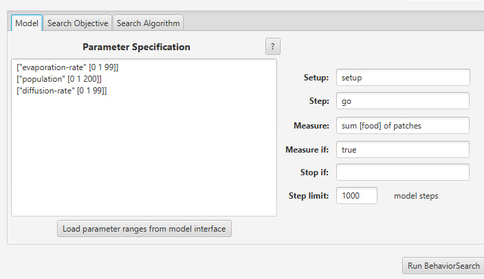
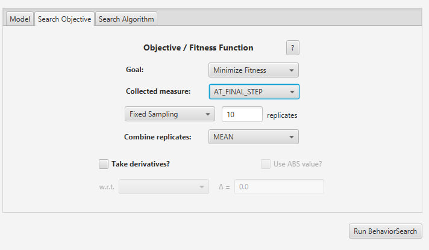
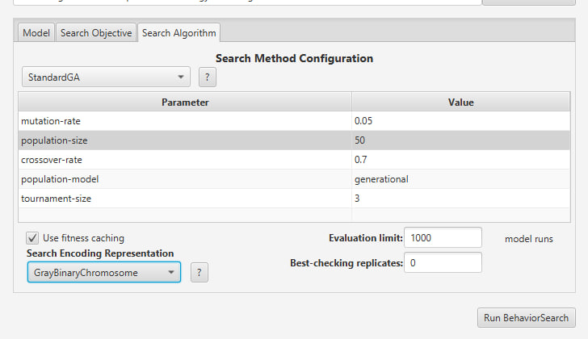
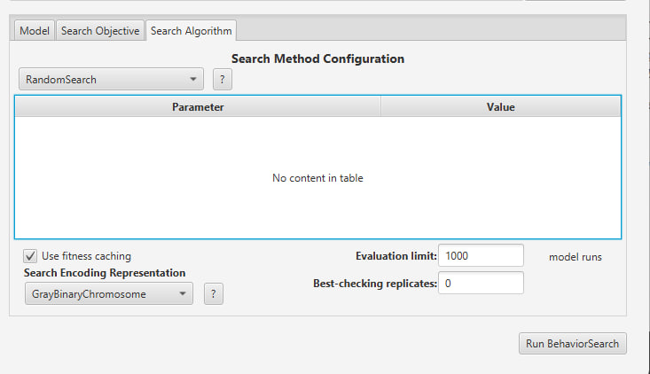
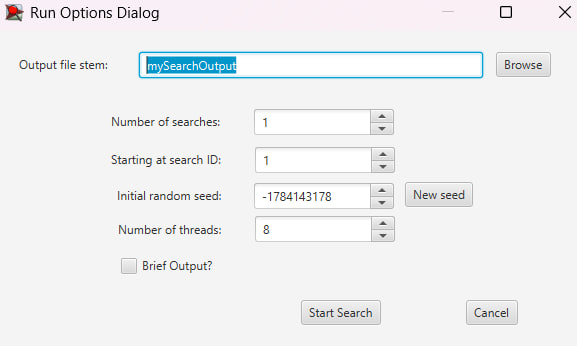
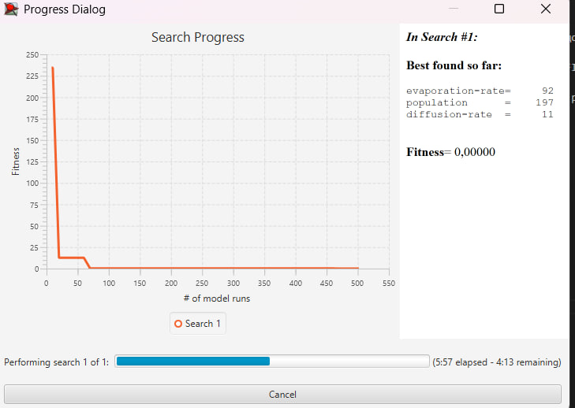
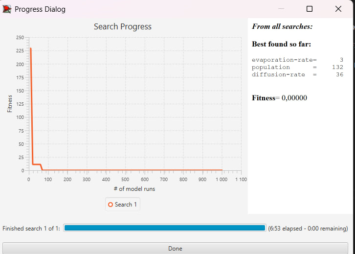

## Комп'ютерні системи імітаційного моделювання
## СПм-24-2, **Кліменко Артем Володимирович**
### Лабораторна робота №**3**. Використання засобів обчислювального интелекту для оптимізації імітаційних моделей

<br>

### Варіант 10, модель у середовищі NetLogo:
[Ants](https://www.netlogoweb.org/launch#http://www.netlogoweb.org/assets/modelslib/Sample%20Models/Biology/Ants.nlogox)

### 1. Вербальний опис моделі:

Ця модель відтворює механізм самоорганізації мурашиної колонії під час пошуку та збору ресурсів. Кожна мураха діє як автономний агент, що керується простими правилами: блукання у пошуках їжі, маркування успішного шляху феромонами та слідування за хімічним сигналом, залишеним іншими. Завдяки позитивному зворотному зв'язку (чим більше мурах пройшло шляхом, тим сильніший запах) колонія знаходить оптимальні маршрути до джерел харчування, створюючи складну систему логістики без єдиного центру керування.

### 2. Керуючі параметри:

* **population**: Визначає загальну кількість мурах у симуляції (0–200). Впливає на швидкість виявлення нових джерел та інтенсивність підтримки феромонних стежок.
* **diffusion-rate**: Коефіцієнт поширення феромонів. Визначає, наскільки активно хімічна речовина розсіюється на сусідні ділянки, розширюючи "зону видимості" стежки.
* **evaporation-rate**: Швидкість випаровування. Регулює час життя хімічного сліду. Високі значення змушують мурах швидше адаптуватися до нових умов, але роблять стежки менш стабільними.

### Внутрішні параметри:

* **chemical**: Концентрація феромону на конкретному патчі. Візуально відображається відтінками зеленого.
* **food**: Кількість одиниць їжі на ділянці (0, 1 або 2).
* **nest?**: Булева змінна, що ідентифікує центральну зону як гніздо колонії.
* **nest-scent**: Статичне числове поле, значення якого зростає при наближенні до гнізда. Використовується мурахами як навігаційний орієнтир (компас) для повернення додому.
* **food-source-number**: Номер джерела їжі (1, 2 або 3), що дозволяє розрізняти різні локації ресурсів.

### Налаштування середовища BehaviorSearch:

**Обрана модель**:

<pre>
\models\Sample Models\Biology\Ants.nlogox
</pre>


### 3. Налаштування середовища BehaviorSearch

Для оптимізації роботи моделі було обрано стратегію **мінімізації залишків їжі**. Мета — знайти такі параметри колонії, за яких мурахи збирають 100% доступної їжі за найкоротший час.

#### Налаштування моделі (Model Tab):

* **Model file:** `Ants.nlogox`
* **Measure (Показник):** `sum [food] of patches`
* **Measure if:** `true`
* **Setup:** `setup`
* **Step:** `go`
* **Step limit:** `1000` (Встановлено достатньо великий ліміт часу, щоб мурахи встигли зібрати всю їжу).



### Параметри оптимізації (Search Objective):

* **Goal:** `Minimize Fitness` (Мінімізація цільової функції).
* **Collected measure:** `AT_FINAL_STEP` (Оцінюється стан системи в самому кінці симуляції).
* **Evaluation limit:** `1000` ітерацій (для забезпечення достатньої глибини пошуку).



#### Простір пошуку параметрів:

```text
["diffusion-rate" [0 1 99]]
["evaporation-rate" [0 1 99]]
["population" [10 10 200]]

```



---

### 4. Результати дослідження

#### Експеримент 1: Генетичний алгоритм (StandardGA)

Для пошуку оптимальних параметрів було використано генетичний алгоритм (Genetic Algorithm).



**Аналіз результатів StandardGA:**
На графіку видно швидку збіжність алгоритму. Вже після перших 50-70 ітерацій функція пристосованості (Fitness) впала до значення **0.00000**. Це означає, що алгоритм знайшов конфігурацію, за якої мурахи повністю очищують поле від їжі.

**Знайдені параметри:**

* **population:** 197 (Майже максимальна популяція).
* **evaporation-rate:** 92 (Дуже висока швидкість випаровування).
* **diffusion-rate:** 11 (Низька дифузія).

**Інтерпретація:** Генетичний алгоритм обрав стратегію "масованої атаки". Велика кількість мурах забезпечує покриття поля, а висока швидкість випаровування дозволяє швидко "забувати" старі або помилкові шляхи, що запобігає зацикленню агентів на порожніх місцях.

#### Експеримент 2: Випадковий пошук (Random Search)



Для порівняння було використано метод випадкового пошуку (Monte Carlo).

**Аналіз результатів RandomSearch:**
Цей метод також зміг знайти ідеальне рішення (Fitness = 0.00000), проте динаміка пошуку була іншою.

**Знайдені параметри:**

* **population:** 132 (Середня чисельність).
* **evaporation-rate:** 3 (Екстремально низьке випаровування).
* **diffusion-rate:** 36 (Помірна дифузія).

**Інтерпретація:** Випадковий пошук виявив альтернативну стратегію — "стабільність". При низькому випаровуванні феромонні шляхи зберігаються дуже довго. Це дозволяє меншій кількості мурах (132) ефективно слідувати вже протореними доріжками, не втрачаючи напрямок до джерел їжі.

---

### 5. Висновки

У ході виконання лабораторної роботи було проведено оптимізацію імітаційної моделі "Ants" за допомогою інструменту BehaviorSearch.

1. **Ефективність інструментів:** Обидва алгоритми (StandardGA та RandomSearch) успішно впоралися із завданням, знайшовши параметри, за яких ефективність збору їжі є максимальною (залишок їжі = 0).
2. **Множинність рішень:** Експеримент продемонстрував, що одна й та сама мета в складній системі може бути досягнута різними шляхами:
* **Шлях 1 (знайдено ГА):** Висока щільність агентів + швидке оновлення інформації (високе випаровування).
* **Шлях 2 (знайдено RandomSearch):** Помірна кількість агентів + довготривала пам'ять системи (низьке випаровування).
3. **Практичне значення:** Використання автоматизованого пошуку параметрів дозволяє виявити неочевидні залежності в моделі (наприклад, ефективність екстремально високого рівня випаровування при великій популяції), які складно передбачити при ручному налаштуванні.


